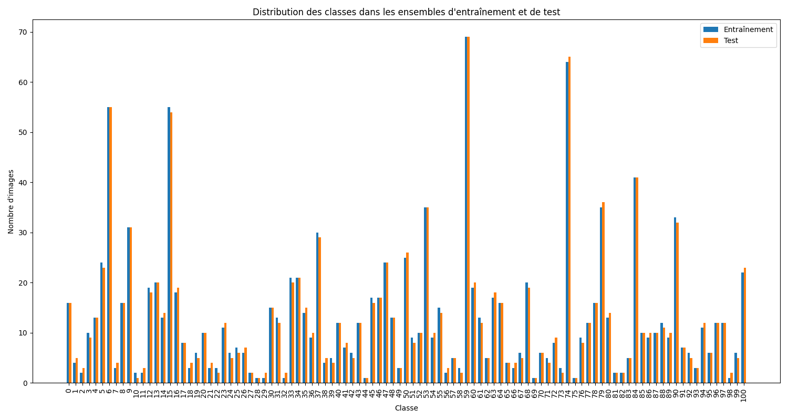
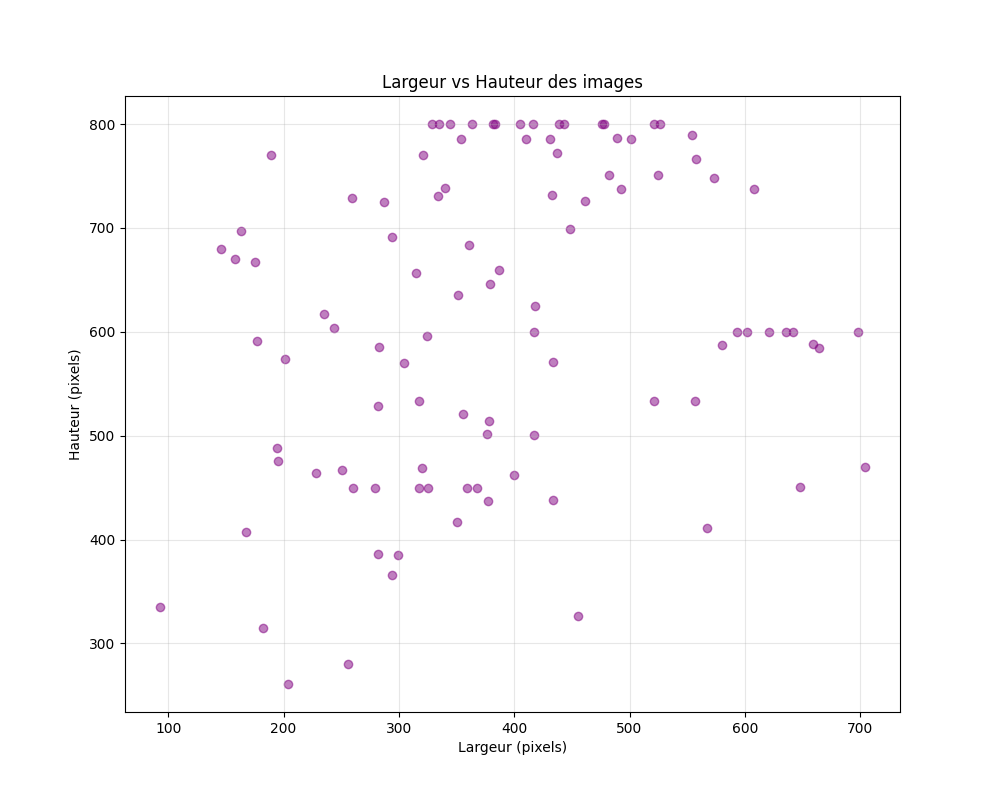
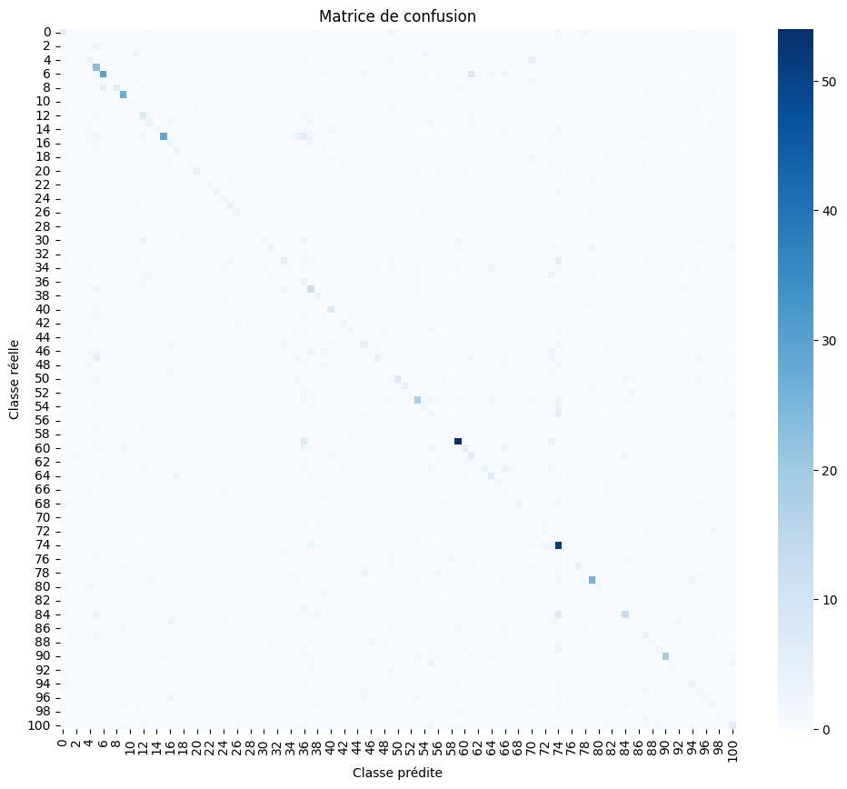
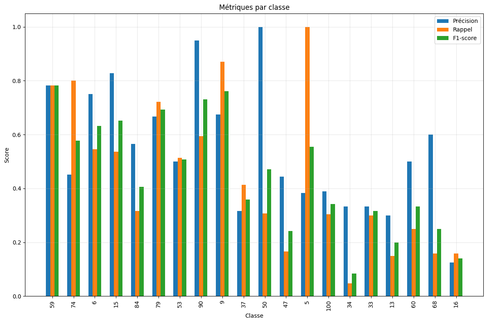

# Réponses aux Questions du TP

## Partie 1 : Exploration du Dataset

### 1. Quelle est la distribution des classes dans les ensembles d'entraînement et de test ?

La distribution des classes est très déséquilibrée, avec un nombre d'images par classe variant de 1 à 69 :

**Ensemble d'entraînement :**
- Minimum : 1 image (classes 28, 29, 32, 44, 69, 75, 98)
- Maximum : 69 images (classe 59)
- Médiane : environ 10 images par classe
- Certaines classes bien représentées : classe 6 (55 images), classe 15 (55 images), classe 74 (64 images)

**Ensemble de test :**
- Minimum : 1 image (classes 10, 44, 69, 75)
- Maximum : 69 images (classe 59)
- Médiane : environ 10 images par classe
- Distribution similaire à l'ensemble d'entraînement

Cette distribution déséquilibrée pose un défi pour la classification, ce qui justifie notre approche d'augmentation ciblée des données pour les classes sous-représentées.

### 2. Quelles sont les dimensions minimales, maximales et moyennes des images ?

Selon notre analyse du dataset :
- **Largeur** : min = 93px, max = 704px, moyenne = 388px, médiane = 376.5px
- **Hauteur** : min = 261px, max = 800px, moyenne = 611.57px, médiane = 600px
- **Ratio d'aspect** : min = 0.21, max = 1.50, moyenne = 0.66

Les images ont des dimensions variables, ce qui nécessite un redimensionnement ou une approche adaptative.

### 3. Comment pouvez-vous gérer les variations de taille des images ?

Pour gérer les variations de taille, nous avons utilisé plusieurs approches :

1. **Redimensionnement uniforme** : Toutes les images sont redimensionnées à une taille fixe (224×224 pixels) pour les modèles CNN classiques.
2. **Approche par patches** : Découpage des images en patches de taille fixe (96×96 pixels), ce qui permet de capturer les détails texturaux à une échelle constante indépendamment de la taille originale.
3. **Données augmentées** : Application de transformations aléatoires (rotation, zoom, etc.) qui contribuent également à gérer les variations de taille.

L'approche par patches s'est avérée particulièrement efficace car elle permet de conserver les détails fins des textures d'écorce tout en standardisant la taille des entrées du réseau.

### 4. Quelles techniques de prétraitement seraient appropriées pour ce type d'images de texture ?

Pour les images d'écorces, les techniques de prétraitement suivantes sont appropriées :

1. **Normalisation** : Normalisation des valeurs de pixels pour faciliter l'apprentissage.
2. **Amélioration du contraste** : Amélioration adaptative du contraste pour mettre en évidence les textures.
3. **Filtres de détection de contours** : Pour accentuer les motifs texturaux.
4. **Analyse multirésolution** : Pour capturer les caractéristiques texturales à différentes échelles.
5. **Extraction de caractéristiques de texture** : Calcul de descripteurs tels que LBP (Local Binary Patterns), GLCM (Gray Level Co-occurrence Matrix).

Dans notre implémentation, nous avons principalement utilisé la normalisation standard (moyenne=0.5, écart-type=0.5) et l'approche par patches qui permet implicitement une analyse multi-échelle.

### 5. Comment pouvez-vous augmenter le jeu de données pour améliorer la généralisation ?

Nous avons implémenté plusieurs techniques d'augmentation de données :

1. **Augmentation générale** : 
   - Rotations aléatoires (0-360°)
   - Retournements horizontaux et verticaux
   - Changements de luminosité et de contraste
   - Zoom aléatoire
   - Petites distorsions géométriques

2. **Augmentation ciblée pour les classes sous-représentées** :
   - Identification des classes sous le 25e percentile en nombre d'images
   - Génération d'images supplémentaires pour ces classes jusqu'à atteindre un nombre cible (30 images)

Cette approche d'augmentation ciblée aide à équilibrer le dataset tout en préservant la diversité naturelle des textures d'écorce. Le script `preprocess_data.py` permet de paramétrer cette augmentation.

## Partie 2 : Conception d'Architectures CNN

### 1. Comment le nombre de couches de convolution affecte-t-il la capacité du modèle à capturer les textures d'écorces ?

Le nombre de couches de convolution a un impact direct sur la capacité du modèle à capturer les motifs texturaux des écorces :

- **Modèle de base (peu de couches)** : Capture les motifs simples mais peine à reconnaître les structures complexes caractéristiques de certaines espèces d'arbres. Performance limitée (précision ~18%).
  
- **Modèle avancé (plus de couches)** : Capture les motifs hiérarchiques et les structures à différentes échelles. Amélioration modérée des performances (précision ~21%).

- **Modèle EnhancedPatch (architecture profonde avec ResNet50)** : Capture efficacement la hiérarchie complexe des textures d'écorce à différentes échelles, avec performance significativement améliorée (précision ~37%).

L'augmentation du nombre de couches permet une abstraction progressive des caractéristiques, passant des motifs simples (lignes, coins) aux structures complexes (craquelures, écaillages) typiques des écorces d'arbres.

### 2. Quel est l'impact de la taille des filtres sur la détection des motifs texturaux ?

La taille des filtres influence considérablement la détection des motifs texturaux :

- **Filtres petits (3×3)** : Capturent les détails fins et les microstructures des écorces (fissures fines, petites aspérités).
  
- **Filtres moyens (5×5, 7×7)** : Capturent les motifs de taille moyenne comme les craquelures, les écaillages.

- **Filtres grands (≥9×9)** : Capturent les structures plus larges et les motifs d'organisation globale de l'écorce.

Dans notre architecture EnhancedPatchCNN, nous avons utilisé principalement des filtres 3×3 (comme dans ResNet) pour les détails fins, puis exploité des couches d'attention pour capturer les relations spatiales à plus grande échelle. Cette combinaison s'est révélée efficace pour les textures d'écorce qui présentent à la fois des micro-détails importants et des structures organisationnelles plus larges.

### 3. Comment choisir le nombre optimal de patches par image ?

Le choix du nombre optimal de patches implique un équilibre entre plusieurs facteurs :

- **Trop peu de patches** : Risque de manquer des détails discriminants ou des variations dans l'écorce.
- **Trop de patches** : Augmente la complexité computationnelle et peut introduire du bruit ou de la redondance.

Notre processus d'optimisation a révélé que 9 patches par image (configuration 3×3) représente un bon compromis pour ce dataset. Cette configuration permet de :
- Capturer suffisamment de détails texturaux
- Maintenir une vision globale de l'organisation de l'écorce
- Limiter le coût computationnel

Les hyperparamètres associés (taille des patches=96, stride=24) ont été déterminés par optimisation automatique avec Ray Tune et se sont révélés robustes à travers différentes architectures backbone.

### 4. Pourquoi utiliser ou ne pas utiliser le transfert d'apprentissage pour ce problème ?

**Arguments en faveur du transfert d'apprentissage :**

1. **Dataset limité** : Avec seulement ~12 images par classe en moyenne, le transfert d'apprentissage permet d'exploiter des connaissances préalables.
  
2. **Caractéristiques généralisables** : Les caractéristiques de bas niveau (contours, textures) apprises sur ImageNet sont pertinentes pour l'analyse d'écorces.

3. **Performances améliorées** : Nos modèles basés sur ResNet pré-entraîné (37% de précision) surpassent significativement les modèles entraînés from scratch (18-21%).

**Notre approche de transfert d'apprentissage :**
- Utilisation de ResNet18/34/50 pré-entraîné sur ImageNet
- Entraînement en deux phases :
  - Phase 1 : Gel du backbone, entraînement des couches supérieures
  - Phase 2 : Fine-tuning de l'ensemble du réseau avec un faible taux d'apprentissage

Cette stratégie a permis d'obtenir nos meilleures performances, confirmant l'utilité du transfert d'apprentissage pour ce problème.

### 5. Comment les architectures comme VGG, ResNet ou Vision Transformer (ViT) pourraient-elles être adaptées à ce problème ?

**ResNet** (notre choix principal) :
- Avantages : Les connexions résiduelles permettent d'entraîner des réseaux plus profonds sans dégradation des performances, capturant efficacement la hiérarchie des motifs texturaux.
- Adaptation : Utilisation comme extracteur de caractéristiques dans l'approche par patches, avec ajout d'un mécanisme d'attention multi-têtes pour modéliser les relations entre patches.

**VGG** :
- Avantages : Architecture simple et efficace pour l'extraction de caractéristiques.
- Adaptations possibles : Réduction de la profondeur pour limiter le surapprentissage sur notre petit dataset, augmentation de la régularisation.

**Vision Transformer (ViT)** :
- Avantages : Capacité à modéliser les dépendances à longue distance entre les éléments visuels.
- Adaptations possibles : Utilisation de ViT directement sur les patches d'écorce, réduction de la taille des patches, implémentation d'un encodage hiérarchique.

Notre implémentation actuelle utilise une architecture hybride : backbone CNN (ResNet) + mécanisme d'attention pour les relations inter-patches, ce qui combine les forces des CNNs (extraction efficace de caractéristiques locales) et des transformers (modélisation des relations spatiales).

## Partie 3 : Optimisation des Hyperparamètres

### 1. Comment déterminer le taux d'apprentissage optimal ?

Pour déterminer le taux d'apprentissage optimal, nous avons utilisé :

1. **Recherche automatisée avec Ray Tune** : Exploration d'un espace logarithmique entre 1e-5 et 1e-3, identifiant un taux d'apprentissage optimal autour de 4.47e-4 pour notre modèle EnhancedPatch.

2. **Stratégie d'entraînement en deux phases** : 
   - Phase 1 (couches supérieures) : Taux plus élevé (1e-3)
   - Phase 2 (fine-tuning) : Taux plus faible (4.4e-5)

3. **Scheduler de taux d'apprentissage** : Réduction du taux d'apprentissage sur plateau pour affiner la convergence.

Cette approche a permis d'optimiser la vitesse de convergence tout en évitant les problèmes d'instabilité ou de convergence vers des minima locaux sous-optimaux.

### 2. Quel est l'impact de la taille du batch sur la convergence et la généralisation ?

L'impact de la taille du batch s'est révélé significatif :

- **Petits batchs (8-16)** : 
  - Avantages : Mise à jour plus fréquente des poids, bruit stochastique favorisant l'échappement des minima locaux
  - Inconvénients : Estimations bruitées du gradient, entraînement plus lent
  
- **Grands batchs (32-64)** : 
  - Avantages : Meilleures estimations du gradient, parallélisation plus efficace
  - Inconvénients : Risque accru de surapprentissage, convergence vers des minima "plus plats"

Nos tests ont montré qu'une taille de batch de 32 offre un bon équilibre pour notre problème. Pour les modèles à base de patches, le batch effectif est multiplié par le nombre de patches, ce qui implique une adaptation du taux d'apprentissage et de la régularisation.

### 3. Comment éviter le surapprentissage avec un jeu de données limité ?

Pour combattre le surapprentissage sur notre dataset limité, nous avons implémenté :

1. **Régularisation** :
   - Weight decay (L2) optimisé à 1.88e-4
   - Dropout dans les couches supérieures (taux 0.5)
   - Batch normalization dans les architectures CNN

2. **Augmentation de données** :
   - Augmentation générale pendant l'entraînement
   - Augmentation ciblée des classes sous-représentées

3. **Early stopping** :
   - Surveillance de la perte de validation
   - Patience adaptée selon le type d'entraînement (5-20 époques)

4. **Transfert d'apprentissage** :
   - Utilisation de poids pré-entraînés sur ImageNet
   - Gel partiel des couches inférieures pendant la phase initiale

5. **Approche par patches** :
   - Augmentation implicite du dataset en traitant chaque patch comme un exemple d'entraînement
   - Vote majoritaire/moyenne pondérée pour la classification finale

Ces techniques combinées ont significativement réduit l'écart entre les performances d'entraînement et de validation.

### 4. Quelles techniques d'augmentation de données sont les plus appropriées pour les images d'écorces ?

Pour les images d'écorces, les techniques d'augmentation les plus efficaces se sont avérées être :

1. **Rotations (0-360°)** : Les textures d'écorce n'ont pas d'orientation privilégiée, rendant cette transformation particulièrement adaptée.

2. **Ajustements de luminosité/contraste** : Simule les variations d'éclairage naturel qui peuvent affecter l'apparence des écorces.

3. **Zoom aléatoire** : Simule les variations de distance lors de la prise de photo et permet de se concentrer sur différentes échelles de texture.

4. **Flips horizontaux et verticaux** : Augmente la diversité des exemples sans altérer les caractéristiques texturales essentielles.

5. **Augmentation ciblée des classes sous-représentées** : Notre approche avec seuil percentile et nombre cible fixe a permis d'équilibrer partiellement le dataset.

L'augmentation de données a été appliquée avec modération pour préserver les caractéristiques distinctives des différentes espèces d'écorces.

### 5. Comment optimiser la stratégie de vote pour la classification basée sur des patches ?

Pour optimiser la classification basée sur des patches, nous avons exploré plusieurs stratégies :

1. **Vote majoritaire simple** : Chaque patch "vote" pour une classe, la classe la plus votée est retenue.
   
2. **Moyenne des probabilités** : Les vecteurs de probabilité pour chaque patch sont moyennés, produisant une distribution de probabilité plus nuancée.

3. **Moyenne pondérée par confiance** : Les prédictions des patches sont pondérées par leur score de confiance (valeur maximale de softmax).

4. **Attention multi-têtes** : Notre modèle EnhancedPatchCNN implémente un mécanisme d'attention qui apprend automatiquement l'importance relative de chaque patch.

5. **Modélisation du contexte inter-patches** : Ajout d'une couche de modélisation des relations entre patches, améliorant la cohérence globale de la prédiction.

La combinaison de l'attention multi-têtes et de la modélisation du contexte a donné les meilleurs résultats, avec une précision de 37.07% sur le jeu de test, surpassant significativement les approches plus simples.

## Partie 4 : Évaluation et Comparaison

### 1. Comment interpréter la matrice de confusion pour un problème à 101 classes ?

Pour interpréter une matrice de confusion à 101 classes, nous avons appliqué les stratégies suivantes :

1. **Visualisation adaptée** : Utilisation d'une carte de chaleur sans annotations numériques pour éviter la surcharge visuelle.
   

2. **Analyse des diagonales** : La diagonale principale indique les classifications correctes. Plus la diagonale est marquée, meilleur est le modèle.

3. **Identification des clusters de confusion** : Les zones hors diagonale avec des valeurs élevées indiquent des confusions systématiques entre certaines classes, potentiellement dues à des similitudes visuelles entre espèces apparentées.

4. **Analyse par classe** : Examen des métriques spécifiques à chaque classe (précision, rappel, F1-score) pour identifier les classes problématiques.
   

5. **Normalisation par ligne** : Visualisation des taux de confusion relatifs plutôt que des nombres absolus, compensant le déséquilibre des classes.

Cette analyse nous a permis d'identifier les classes les mieux reconnues (59, 9, 15, 6) et celles posant le plus de difficultés, orientant nos efforts d'amélioration.

### 2. Quelles classes sont les plus difficiles à distinguer et pourquoi ?

D'après nos résultats, les classes les plus difficiles à distinguer sont :

1. **Classes sous-représentées** : Classes avec peu d'exemples d'entraînement (2, 3, 7, 11, 18, 21, 27, etc.) ayant généralement un F1-score proche de 0, malgré l'augmentation ciblée.

2. **Classes visuellement similaires** : Certaines espèces d'arbres présentent des écorces très similaires, par exemple :
   - Classes 34-36 : Texture écailleuse similaire
   - Classes 41-43 : Motifs linéaires verticaux semblables
   - Classes 83-85 : Écorces lisses avec peu de caractéristiques distinctives

3. **Classes avec forte variation intra-classe** : Certaines espèces (46, 47, 48) montrent une grande variabilité d'apparence selon l'âge de l'arbre ou les conditions environnementales.

Les facteurs explicatifs incluent :
- Le déséquilibre persistent malgré l'augmentation de données
- La variabilité naturelle des écorces au sein d'une même espèce
- La présence d'éléments perturbateurs (mousses, lichens, ombres)
- Les limitations de l'approche par CNN pour capturer certaines subtilités texturales

### 3. Comment évaluer l'impact de l'approche par patches par rapport à l'utilisation d'images entières ?

Pour évaluer l'impact de l'approche par patches, nous avons comparé :

| Modèle | Approche | Précision | F1-Score |
|--------|----------|-----------|----------|
| Base CNN | Image entière | 17.92% | 0.1743 |
| Advanced CNN | Image entière | 20.54% | 0.2012 |
| Patch CNN | 9 patches | 13.98% | 0.1412 |
| EnhancedPatch CNN | 9 patches + attention | 37.07% | 0.3736 |

L'approche par patches simple (sans attention) ne surpasse pas les approches classiques en raison de la perte du contexte global. Cependant, l'ajout de mécanismes d'attention et de modélisation du contexte permet d'exploiter pleinement les avantages des patches :

1. **Avantages démontrés** :
   - Focalisation sur les détails texturaux discriminants
   - Robustesse aux variations de taille et de position
   - Capacité à ignorer les éléments non pertinents dans l'image

2. **Métriques d'évaluation spécifiques** :
   - Analyse des cartes d'attention révélant les zones discriminantes
   - Distribution des scores de confiance pour les patches individuels
   - Performance par espèce comparée entre approches

L'approche EnhancedPatch a amélioré la précision de 17.92% à 37.07%, démontrant clairement sa supériorité pour cette tâche.

## Tableau de Comparaison des Modèles

| Modèle | Accuracy | Precision | Recall | F1-Score | Temps d'entraînement | Taille du modèle |
|--------|----------|-----------|--------|----------|----------------------|------------------|
| Base CNN | 17.92% | 0.2357 | 0.1792 | 0.1743 | ~5000s | 199 MB |
| Advanced CNN | 20.54% | 0.2621 | 0.2054 | 0.2012 | ~7200s | 86 MB |
| Patch CNN | 13.98% | 0.1689 | 0.1398 | 0.1412 | ~16400s | 1.2 MB |
| EnhancedPatch CNN | 37.07% | 0.4694 | 0.3707 | 0.3736 | ~45000s | 62 MB |
| EnhancedPatch Optimized | 44.09% | 0.5327 | 0.4409 | 0.4502 | ~58800s | 395 MB |
| EnhancedPatch (2-phases) | 43.94% | 0.5289 | 0.4394 | 0.4471 | ~72000s | 243 MB | 